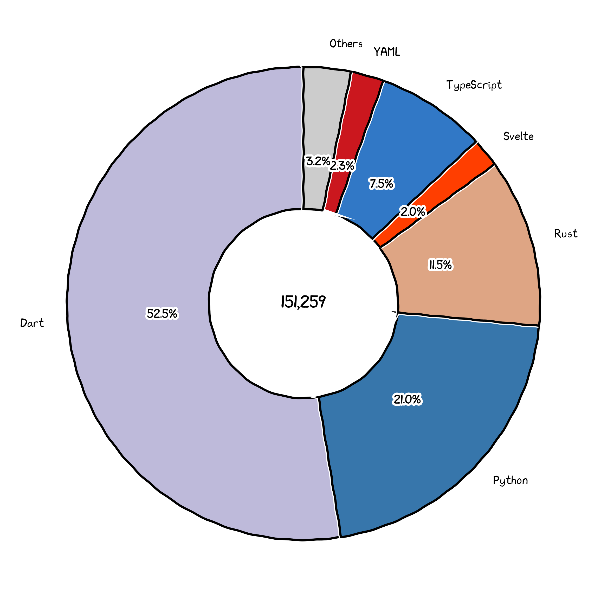

# EVE Fit Assistant

## Overview

> This branch (`dev`) is under active development.
> The `main` branch is deprecated; all releases ship from `dev`.

EFA is a cross-platform EVE fitting tool for mobile devices (Android).
The current beta focuses on local fit editing with validation,
bundle-backed static data, item and ship hull inspection,
character skill profiles, damage profile switching, and a remote
content system for bundles, announcements, and version notes.

Market statistics and broader EVE reference tools remain planned scope.

> The target form factor is phones. Tablets are not officially
> targeted but may work on larger screens.

The app is datasource-insensitive: it does not bake in server-specific
logic. Unlike the sibling project
[EVE Multitools](https://github.com/Embers-of-the-Fire/EVE-Multitools),
EFA uses a single datasource per installed bundle.

### Platform Support

EFA guarantees support for Android and partial support
for Android-based systems and will release officially
built bundles for Android.

EFA supports building bundles targeting iOS but will not
test and offer pre-built binaries for that platform.
If you want to use EFA on iOS, you have to build
the app yourself following [this guide](#build).

## Architecture

EFA is a multi-language project:

- **Flutter/Dart**: Cross-platform UI frontend.
- **Rust** (via [`flutter_rust_bridge`](https://github.com/fzyzcjy/flutter_rust_bridge)):
  Fitting backend. Core logic lives in the [`eve-fit-os`](https://github.com/Embers-of-the-Fire/eve-fit-os) engine.
- **Python**: Offline data processing (build, bundle generation, CLI tooling).
- **TypeScript/SvelteKit**: Landing page and supporting web services (`site/`).

The app has two layers: the Flutter frontend handles all rendering and interaction,
while the Rust backend computes fit statistics without blocking the UI.

## Development

### Development Tools

It's recommended to use [Android Studio](https://developer.android.com/studio),
but you can also try [Visual Studio Code](https://code.visualstudio.com/).

The repository contains some configurations for both editors for easier development.

### Prerequisites

- Nix with flakes enabled. The repository `flake.nix` provides Flutter, JDK 17,
  Android SDK/NDK, Rust/Cargo, Python, `uv`, protobuf tooling, and FRB codegen.
- If you do not use Nix, provide equivalent Flutter/Dart, Android, Rust, Python,
  `uv`, protobuf, and `flutter_rust_bridge_codegen` tooling yourself.

After setting up the environment,
run the following command to initialize the workspace:

```bash
nix develop      # enter the preferred development shell
flutter pub get  # init flutter
uv sync          # init python
```

> Note: Lock files (`pubspec.lock`, `uv.lock`, `Cargo.lock`) are checked in.
> If you use a mirror for package registries, you may need to regenerate them.

### Configure

Before building the app, you need to do some configuration.

The app uses multiple configurations files to manage the build.
There're mainly three types of configuration files:

- Toml files, which are checked in the repo.
  These files are used to configure the build process regardless
  of the environment.
- Dev Toml files, which are not checked in the repo.
  These files configure local paths, private settings, and developer shortcuts.
- Env files, which are not checked in the repo.
  These files are kept for tools that still read dotenv files directly.

Any configuration file comes with a template file:

- `.env` -> `.env.example`
- `efa.config.toml` -> `efa.config.example.toml`
- `efa.dev.toml` -> `efa.dev.example.toml`
- `data/resources/*/descriptor.toml` -> `data/resources/example/descriptor.toml`.

**Version Control**:
The `efa.config.toml` is checked in, which means changing server
support is also viewed as a breaking change.
The `efa.dev.toml` is private local configuration and must not be checked in.
It owns local mutable paths such as logs and workspace build/cache output.
Only `paths.root` is configurable; the sub-root layout is fixed.
For example, if `efa.dev.toml` sets `paths.root = "cache"`, then workspace
state is placed under `./cache/workspaces/tranquility`,
`./cache/workspaces/serenity`, and so on, while logs are placed under
`./cache/log`.

**Important**:
The backend engine, `eve-fit-os` still uses `.env` files to generate
data and compile the rust code.
However, that project is not configured to support multi-datasource.
To solve this problem, the build CI/CD will internally write some
variables to the environment when building the backend.
But, as the LSP and linter need to build the backend too,
you need local mock variables for backend builds.
Set the `[native]` section in `efa.dev.toml`, then run:

```bash
./x dev env write-backend
```

For this project, we suggest you to use the `tranquility` datasource
for local development, which means the generated `rust/lib/eve-fit-os/.env`
file should look like this:

```env
FSD_BINARY_DIR=/home/admin/develop/eve-fit-assistant/eve-fit-assistant/data/resources/tranquility/fsd
FSD_FORMAT=msgpack
FSD_LOC_EN_DIR=/home/admin/develop/eve-fit-assistant/eve-fit-assistant/cache/workspaces/tranquility/index-cache/resources/localizationfsd/localization_fsd_en-us.pickle
OUTPUT_DIR=/home/admin/develop/eve-fit-assistant/eve-fit-assistant/cache/workspaces/tranquility/native
```

### Build

Generate code and localization after schema, FRB, Dart model, or l10n changes.

```bash
./x generate -f all
```

Generate backend data. For more information, see [data readme](./data/README.md).

```bash
./x workspace list
./x workspace default <workspace>
./x build data
```

Build APK for Android.

```bash
flutter build apk
```

Build IPA for iOS by following the official Flutter documentation.

### Management

The project uses a builtin Python script, [`x.py`](./x.py) to manage the workspace.

You can run `uv run x.py`, `./x` (bash environment) or `./x.ps1` (powershell environment)
to run the script.

> Hint: running `./x` within powershell sometimes works thanks to bash-like aliases,
> but sometimes it doesn't. If you encounter any problem,
> please use `./x.ps1` instead.

Note that it's not recommended to run the script using the global python interpreter,
as the script may depend on some packages only installed in the uv environment.

For more information about the manager, run `./x --help` to see the help message,
or just read the source code of `x.py`.

The X manager is designed to replace any specific command line operations
you may want to do during development.
For example, you can run `./x lint` to lint the whole project.

Common manager commands:

- `./x dev init-cfg`: copy `efa.dev.example.toml` to `efa.dev.toml`.
- `./x dev env install`: install project dependencies for local development.
- `./x dev env write-backend`: generate the backend `.env` from `efa.dev.toml`.
- `./x lint`: run the canonical fix, lint, and format pass.
- `./x format`: format project sources without lint checks.
- `./x generate -f all`: regenerate protobuf, Rust bridge, Dart generated files,
  and localization, then format.
- `./x generate protobuf`: regenerate Python and Dart protobuf outputs.
- `./x generate rust`: regenerate Flutter Rust Bridge glue.
- `./x generate dart`: run Dart `build_runner` codegen.
- `./x generate l10n`: regenerate localization files.
- `./x build data`: build the selected workspace data.

If you want to or have to use a new cmdline operation,
you can add a new subcommand to the manager instead.

### Dev-Only Environment

You can set local developer defaults in `efa.dev.toml` to simplify the development process.
It's strongly not recommended to use these values in production builds.

See [`efa.dev.example.toml`](./efa.dev.example.toml) for more information.

### Data Build Routine

When you need to build data:

1. Select the target workspace with `./x workspace default <workspace>` if needed.
2. Build with `./x build data`.
3. The output is placed in the workspace's generated directory,
   including the V2 content-addressed checkout catalog at `schema/checkouts/<hash>.json`
   and asset store at `schema/assets/`.

#### Hack through workspace management

You may want to test different data sources during development,
while not wanting to modify the default workspace selection.
You can hack through the workspace management system
by adding `--workspace/--ws` when calling `x.py`:

```bash
./x --ws serenity build data
```

## Languages


