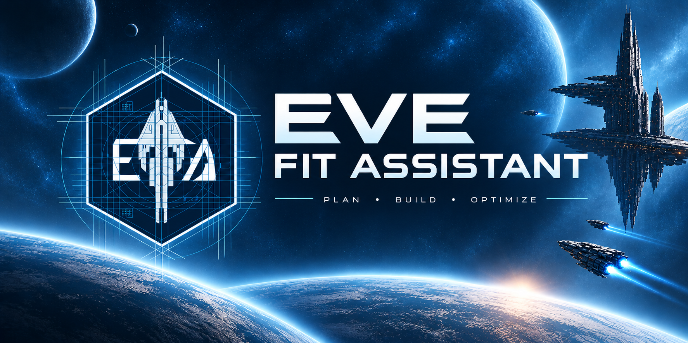
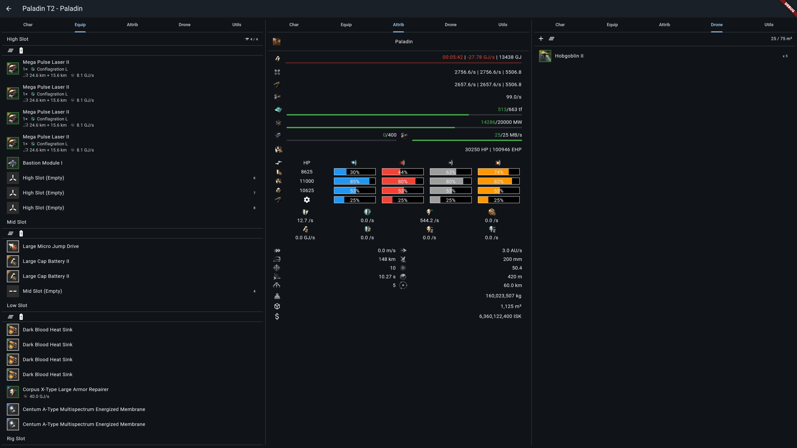
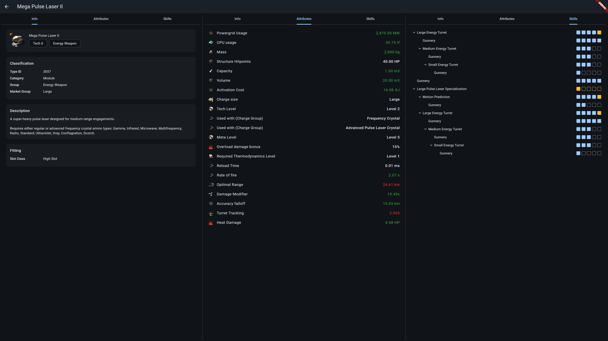
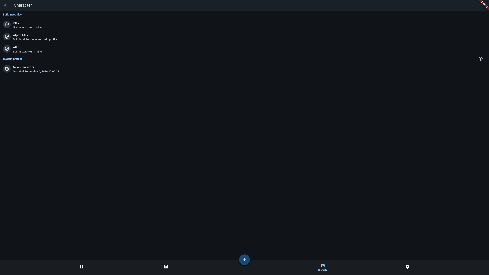
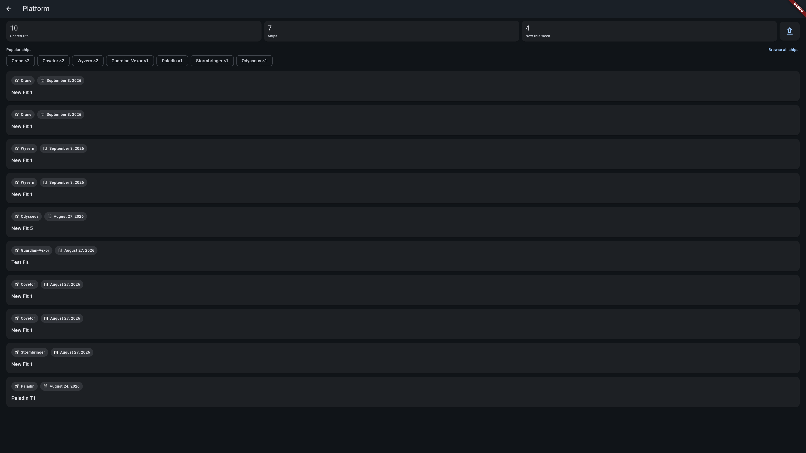

# EVE Fit Assistant

  <strong>English</strong> · <a href="README.zh.md">简体中文</a>

  
  
  
  
  

**EFA** is a free, open-source, cross-platform fitting tool for
[EVE Online](https://www.eveonline.com/). Edit ship fittings offline, inspect
items and hulls, and load your character's skill profiles — all backed by
versioned data bundles with incremental updates, so the app works without a
constant connection.

**[Download](https://efa-tech.dev/download) · [Open Web App](https://app.efa-tech.dev) · [User Manual](https://docs.efa-tech.dev) · [Community Platform](https://platform.efa-tech.dev) · [Report an Issue](https://efa-tech.dev/report/bug)**

> EFA is in public testing (0.x). Things may change and break between
> releases — feedback is very welcome.

## Features

- **Local fit editing** — Create, edit, and experiment with fittings directly
  on your device. All calculations run locally with built-in validation
  (CPU/powergrid, drone & fighter capacity, module state limits).
- **Item & hull inspection** — Browse the complete EVE item database with full
  stats, attributes, and fitting requirements.
- **Character skill profiles** — Manage multiple characters and see exactly how
  skills affect module performance and ship capabilities.
- **Damage profiles & tactical modes** — Switch damage profiles per fit, toggle
  tactical modes, and manage drones/fighters and implant sets.
- **Fit pricing** — Estimate fit cost with buy/sell totals and an itemized
  breakdown, for both Tranquility and Serenity markets.
- **Offline data bundles** — Static game data shipped as versioned, per-server
  bundles (Tranquility / Serenity / Singularity) with incremental updates and
  rollback.
- **Fit sharing & community** — Share fits via snapshots and deep links, or
  publish them to the [community platform](https://platform.efa-tech.dev) and
  browse other players' fits in the app.
- **AI assistant** — Optional built-in chat (bring your own API key) that can
  read, analyze, and edit fits.
- **Cross-platform** — One app for web, Android, and desktop.
- **中文支持** — Full English and Simplified Chinese UI.

Market statistics and broader EVE reference tools are planned but not yet
available.

## Screenshots

<!-- Placeholder images: replace docs/images/*.placeholder.png with real
     screenshots named without the `.placeholder` part. -->

  
  

  
  

## Get EFA

| Platform | Status | How to get it |
| -------- | ------ | ------------- |
| **Web** | Stable & nightly | Use [app.efa-tech.dev](https://app.efa-tech.dev) (stable) or [app-preview.efa-tech.dev](https://app-preview.efa-tech.dev) (nightly, may be unstable). Requires a modern Chromium-based browser or Firefox; Safari may not be fully supported. |
| **Android** | Official | Download the signed APK for your CPU architecture from [efa-tech.dev/download](https://efa-tech.dev/download). The app also detects and downloads updates in the background. |
| **Windows** | Preview | Native zip or per-user MSI installer from the [download page](https://efa-tech.dev/download). |
| **Linux** | Preview | AppImage or native zip from the [download page](https://efa-tech.dev/download). |
| **iOS** | Self-build only | No pre-built binaries are provided; build from source following the [development guide](docs/dev/development.md#build). |

The app is designed for phones first; tablets and desktop windows work but are
not the primary target.

## Documentation

- **[User Manual](https://docs.efa-tech.dev)** — getting started, fitting
  guides, sharing, data management, FAQ, and known limitations (English & 中文).
- **Changelog** — per-release notes live in the
  [manual](https://docs.efa-tech.dev) under the "Changelog" sidebar section
  (newest first).
- **[Homepage](https://efa-tech.dev)** — project landing page.

## Support & Feedback

- Found a bug or have a feature idea? Use the
  [report forms](https://efa-tech.dev/report/bug) (they create tracked GitHub
  issues) or open an issue directly on
  [GitHub](https://github.com/Embers-of-the-Fire/eve-fit-assistant/issues).
- Chat with the community on the
  [EFA Platform](https://platform.efa-tech.dev) or join the
  [QQ group](https://qm.qq.com/q/bLyF0dNYTm).
- Security issues: see [SECURITY.md](SECURITY.md).

## Project Status

This repository's `dev` branch is under active development and all releases
ship from it; the `main` branch is deprecated. The current release channel is
`testing` — expect rough edges, and please report what you find.

## For Developers

EFA is a Flutter/Dart app with a Rust fitting engine (via
[`flutter_rust_bridge`](https://github.com/fzyzcjy/flutter_rust_bridge), core
logic in [`eve-fit-os`](https://github.com/Embers-of-the-Fire/eve-fit-os)),
Python data tooling, and TypeScript/SvelteKit web services.

To build from source or contribute, start with the
[development guide](docs/dev/development.md) and [AGENTS.md](AGENTS.md).

EFA is source-insensitive by design: unlike the sibling project
[EVE Multitools](https://github.com/Embers-of-the-Fire/EVE-Multitools),
it never cares where the game data comes from.

## License

EVE Fit Assistant is dual-licensed under the
[MIT License](LICENSE-MIT) and the
[Apache License, Version 2.0](LICENSE-APACHE), at your option.

---

EVE Online and the EVE logo are the registered trademarks of CCP hf. All
rights are reserved worldwide. All other trademarks are the property of their
respective owners. EVE Fit Assistant is a third-party tool and is not endorsed
by CCP hf.
